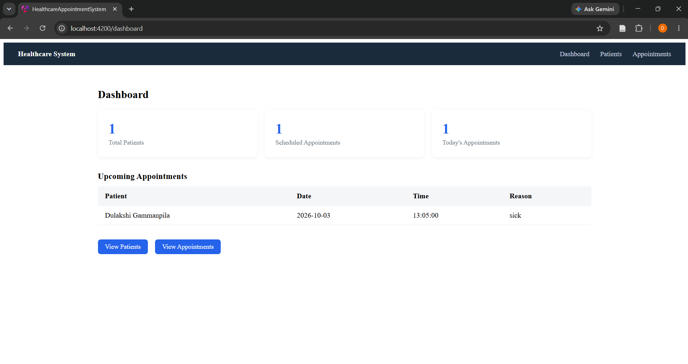
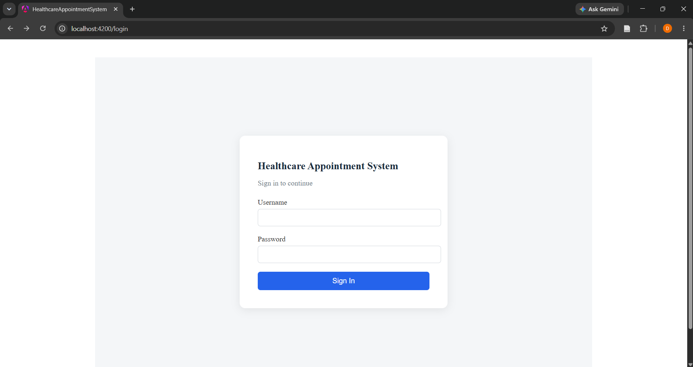
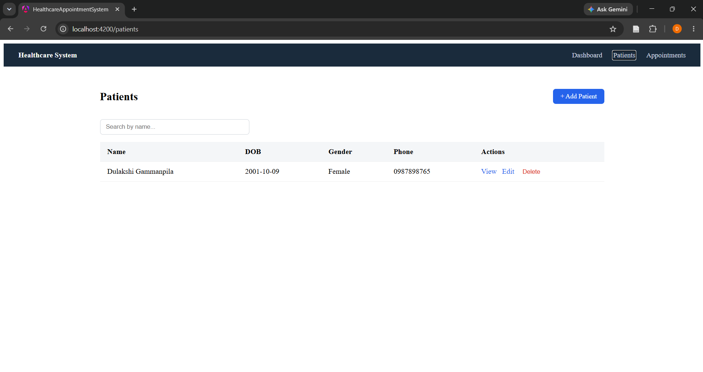
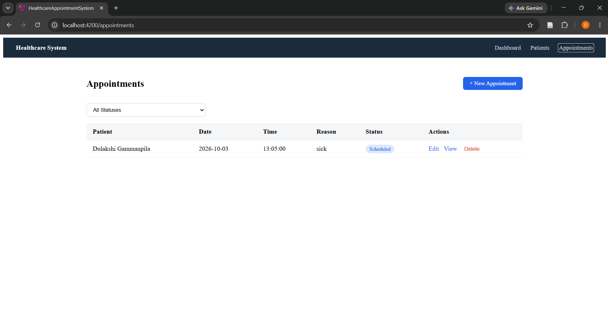
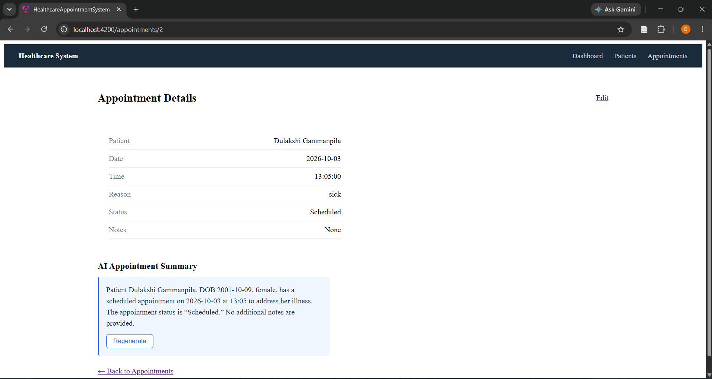

# Healthcare Appointment Management System

A full-stack appointment management system for clinics — patient records, appointment scheduling, JWT-secured REST APIs, and an AI-generated appointment summary powered by Groq.

Built as a focused technical project to demonstrate the Java + Angular + AI-assisted development combination relevant to healthcare software roles.

## Tech Stack

**Frontend:** Angular (standalone components, signals, reactive forms, HTTP interceptors)
**Backend:** Spring Boot 4, Spring Security (JWT), Spring Data JPA
**Database:** PostgreSQL
**AI:** Groq API (Llama 3.3 70B) for appointment summaries
**Testing:** JUnit 5, Mockito

## Features

- Patient CRUD (create, view, edit, delete, search/filter)
- Appointment CRUD with patient linkage, status tracking (Scheduled/Completed/Cancelled)
- JWT-based authentication, protected routes on both frontend and backend
- Dashboard with live patient/appointment stats and an upcoming-appointments view
- AI-generated appointment summaries — a concise clinical summary generated from patient + appointment data on demand
- Form validation (frontend reactive forms + backend Bean Validation)
- Unit and controller-layer tests for the backend

## Project Structure

healthcare-appointment-system/
frontend/ Angular app
backend/ Spring Boot app


## Running Locally

### Prerequisites
- Node.js + Angular CLI
- Java 17+ and Maven (or use the bundled `mvnw`)
- PostgreSQL running locally

### 1. Database
Create the database:
```sql
CREATE DATABASE healthcare_db;
```

### 2. Backend
```bash
cd backend
set DB_PASSWORD=your_postgres_password
set GROQ_API_KEY=your_groq_api_key
mvnw spring-boot:run
```
Runs on `http://localhost:8080`.

> Get a free Groq API key at [console.groq.com](https://console.groq.com). The app runs fine without it except for the AI summary feature.

### 3. Frontend
```bash
cd frontend
npm install --legacy-peer-deps
ng serve
```
Runs on `http://localhost:4200`.

### 4. Create a user and log in
Register your first user (e.g. via Postman):

POST http://localhost:8080/api/auth/register
{ "username": "admin", "password": "admin123" }

Then log in through the app at `http://localhost:4200/login`.

## Running Tests
```bash
cd backend
mvnw test
```

## What I'd Do Differently With More Time

- Role-based access control beyond a single staff role
- Appointment conflict detection (double-booking prevention)
- Externalize the JWT signing key properly for production rather than a fixed dev value
- Pagination for patient/appointment lists
- Deployment (Docker Compose is set up but untested in this iteration)

## Screenshots

_(add screenshots of login, dashboard, patient list, appointment details + AI summary here)_

A few things to do before this is finished:

Fill in the screenshots section — take 4-5 screenshots (login, dashboard, patient list, appointment form, and especially the AI summary in action since that's your differentiator) and add them to a /docs or /screenshots folder, then reference them in the README with .
Decide on the architecture diagram — want me to describe what it should show (a simple Angular ↔ Spring Boot ↔ PostgreSQL + Groq API box diagram), or do you want to skip that and keep the README text-only given time constraints?

Want to do the screenshots next, or move to something else?

can you give me a one whole text

Here's the complete README as one block — copy this directly into README.md at your project root:

markdown
# Healthcare Appointment Management System

A full-stack appointment management system for clinics — patient records, appointment scheduling, JWT-secured REST APIs, and an AI-generated appointment summary powered by Groq.

Built as a focused technical project to demonstrate the Java + Angular + AI-assisted development combination relevant to healthcare software roles.

## Tech Stack

**Frontend:** Angular (standalone components, signals, reactive forms, HTTP interceptors)
**Backend:** Spring Boot 4, Spring Security (JWT), Spring Data JPA
**Database:** PostgreSQL
**AI:** Groq API (openai/gpt-oss-20b) for appointment summaries
**Testing:** JUnit 5, Mockito

## Features

- Patient CRUD (create, view, edit, delete, search/filter)
- Appointment CRUD with patient linkage, status tracking (Scheduled/Completed/Cancelled)
- JWT-based authentication, protected routes on both frontend and backend
- Dashboard with live patient/appointment stats and an upcoming-appointments view
- AI-generated appointment summaries — a concise clinical summary generated from patient and appointment data on demand
- Form validation (frontend reactive forms + backend Bean Validation)
- Unit and controller-layer tests for the backend

## Project Structure

healthcare-appointment-system/
frontend/ Angular app
backend/ Spring Boot app


## Running Locally

### Prerequisites
- Node.js and Angular CLI
- Java 17+ and Maven (or use the bundled `mvnw`)
- PostgreSQL running locally

### 1. Database
Create the database:
```sql
CREATE DATABASE healthcare_db;
```

### 2. Backend
```bash
cd backend
set DB_PASSWORD=your_postgres_password
set GROQ_API_KEY=your_groq_api_key
mvnw spring-boot:run
```
Runs on `http://localhost:8080`.

Get a free Groq API key at console.groq.com. The app runs fine without it except for the AI summary feature.

### 3. Frontend
```bash
cd frontend
npm install --legacy-peer-deps
ng serve
```
Runs on `http://localhost:4200`.

### 4. Create a user and log in
Register your first user (e.g. via Postman):

POST http://localhost:8080/api/auth/register
{ "username": "admin", "password": "admin123" }

Then log in through the app at `http://localhost:4200/login`.

## Running Tests
```bash
cd backend
mvnw test
```

## What I'd Do Differently With More Time

- Role-based access control beyond a single staff role
- Appointment conflict detection (double-booking prevention)
- Externalize the JWT signing key properly for production rather than a fixed dev value
- Pagination for patient and appointment lists
- Deployment (Docker Compose is set up but untested in this iteration)

## Screenshots

### Login


### Dashboard


### Patient List


### Appointment List


### AI-Generated Appointment Summary

